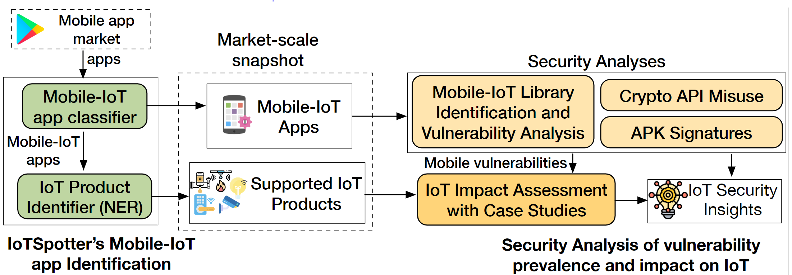

# IoTSpotter：Understanding IoT Security from a Market-Scale Perspective

## Introduction

IoTSpotter is a tool for automatically identifying mobile-IoT apps, IoT specific library, and potential vulnerabilities (i.e., third-party library vulnerabilities, cryptographic API misuse, and Janus vulnerabilities) in the wild based on natural language processing and deep learning. Based on IoTSpotter, we identify 37,783 mobile-IoT apps from google play and 19,939 IoT Specific third-party library package names, which are available in this repo. Moreover, based on the identification results, we discover 43,172 cryptographic violations that affect over 900 apps with more than a million installs each, 65 vulnerable libraries specific to IoT used by 40 apps containing 79 unique vulnerabilities mapped to CVEs, and 7,887 apps that is affected by the Janus vulnerability.

<p align="center"></p>

## Data Release

We provide the corpus and IoTSpotter identification results. Please don't distribute them. We will open source them to the public after the paper is published.

### 1. 37K mobile-IoT apps

37K mobile-IoT apps are listed in this [file](data/apk_androzoo_sha256/shared_sha256_androzoo.csv). The metadata of our identified 37K IoT apps is [here](https://drive.google.com/file/d/1Fq4sGUpEuU7EPnZuxMMCZdWlBXjDD8wN/view?usp=sharing). Each line of the metadata file is a json object, e.g.,
```json
{
  "title": "Doodle It - Pictionary for your Chromecast",
  "icon": "https://play-lh.googleusercontent.com/MBMHhCzEFKYmD1kE88NMMj-wFEcCqSJONGoMcayGjRExEjkvVp6wvKh08X828jHaVA",
  "screenshots": [
    "https://play-lh.googleusercontent.com/zyi_NuligVJYZmjHTTGH2nhfjcD6xVbt5zR_tuPqxmmdhhfe7aPiePe1dCCEV7mIB1Vt=w720-h310-rw",

  ],
  "video": "https://www.youtube.com/embed/sbhm4pjWKuU",
  "category": [
    "GAME_WORD"
  ],
  "score": "4.2",
  "histogram": {
    "1": null,
    "2": null,
    "3": null,
    "4": null,
    "5": null
  },
  "reviews": 84,
  "description": "Whit \"Doodle it\" you can challenge your friends and family in a fun and interactive game where everyone participates!\nThe rules are simple:\n• Split in two teams\n• Each turn, one draws a random word, the rest of the team has to guess it\n• The first team to reach 10 wins!\n\"Doodle it\" is like playing charades with pen and paper, using your tablet as the drawing board.\n\"Doodle it\" is the ideal game to add to your set for a fun game night.\n\"Doodle it\" will challenge your artistic skills and fast thinking trying to draw and guess the more than 1000 different words provided by the FULL package!!!\n\"Doodle it\" will provides a special KIDS package so kids can play and have fun!!!\n\"Doodle it\" will cast your drawings live to your TV! You draw on your tablet, the rest guess from the Chromecast!\n--\n• We are still working on improving the game and we will love to hear your feedback",
  "description_html": "Whit \"Doodle it\" you can challenge your friends and family in a fun and interactive game where everyone participates!<br/><br/>The rules are simple:<br/><br/>• Split in two teams<br/>• Each turn, one draws a random word, the rest of the team has to guess it<br/>• The first team to reach 10 wins!<br/><br/>\"Doodle it\" is like playing charades with pen and paper, using your tablet as the drawing board.<br/><br/>\"Doodle it\" is the ideal game to add to your set for a fun game night.<br/><br/>\"Doodle it\" will challenge your artistic skills and fast thinking trying to draw and guess the more than 1000 different words provided by the FULL package!!!<br/><br/>\"Doodle it\" will provides a special KIDS package so kids can play and have fun!!!<br/><br/>\"Doodle it\" will cast your drawings live to your TV! You draw on your tablet, the rest guess from the Chromecast!<br/><br/>--<br/>• We are still working on improving the game and we will love to hear your feedback",
  "recent_changes": null,
  "editors_choice": false,
  "price": "0",
  "free": true,
  "iap": true,
  "developer_id": "Hi%27ona+Studios",
  "updated": "April 3, 2020",
  "size": "3.0M",
  "installs": "10,000+",
  "current_version": "1.8.3",
  "required_android_version": "5.0 and up",
  "content_rating": [
    "Everyone"
  ],
  "iap_range": [
    "Everyone"
  ],
  "interactive_elements": null,
  "developer": "Hi'ona Studios",
  "developer_email": "hiona.studios@gmail.com",
  "developer_url": "https://www.reddit.com/r/doodle_it",
  "developer_address": "Råggatan 8, lght 1004\n18 59 Stockholm\nSweden",
  "app_id": "com.hiona.doodleit",
  "url": "https://play.google.com/store/apps/details?id=com.hiona.doodleit"
}
```
Since the total file size of all APKs of 37 mobile-IoT apps is more than 100GB, we recommend you to directly download them via [Androzoo](https://androzoo.uni.lu/). For the same APKs that we used for analysis, you can download them via Androzoo APIs with the [sha256 signatures](data/apk_androzoo_sha256/shared_sha256_androzoo.csv). 

### 2. 19K IoT specific package names

Our differential analysis component identifies 19K 3rd-party library package names, which can be found [here](data/3rd_party_lib/filtered_package_names.txt). Each line of the file corresponds to one unique package name. Here, package names are the name of [JAVA packages](https://docs.oracle.com/javase/tutorial/java/concepts/package.html).

### 3. Datasets of mobile-IoT app classifiers

You can find our annotated datasets under [data/dataset](data/dataset), where the `label` is 1 (IoT) and 0 (non-IoT). Part of the IoT app samples are from Wang'2019 USENIX Security paper, we obtained all their apps from this [link](http://seclab.soic.indiana.edu/xw48/iot_companion_appset.tar.gz). Then we removed the apps that were not in GPlay any more and obtained the remaining apps for annotataion. And we provide the remaining app list [here](data/artifacts/app_list.txt).

### 4. Mobile-IoT app classifiers

For the mobile-IoT app classifiers, you can find the BiLSTM classifier under [data/classifiers/](data/classifiers/bilstm.h5) and download the BERT model via this [link](https://drive.google.com/drive/folders/1qzGOPXfE4FLZRfF0GoL1iFdfazwvGGlf?usp=sharing).

### 5. IoT products and name entity recognition (NER) model

You can download the NER dataset, script and model via this [link](https://drive.google.com/file/d/1HxqHFE-VnofdMNHWEyyjLXymRMzrzWfn/view?usp=sharing). After identifying the IoT products, we cluster them with [GSDMM model](https://github.com/rwalk/gsdmm-rust). You can find resulting clusters [here](data/artifacts/iot_product_clustering_results.zip), in which the non-empty files are unique clusters.

## Installation

We recommend `conda` to setup the environment and install the required packages. Conda installation instructions can be found [here](https://docs.conda.io/projects/conda/en/latest/user-guide/install/linux.html). The following setup assumes Conda is installed and is running on Linux system (though Windows should work too).

First, create the conda environment,

`conda create -n iotspotter python=3.8`

and activate the conda enviroment:

`conda activate iotspotter`

Then, install the `pip` package manager and other packages:

`conda install pip`

`pip install -r requirement.txt`

## Mobile-IoT classifier

To train the BiLSTM classfier, you have to first download the pretrained word vectors from [Glove](https://nlp.stanford.edu/data/glove.6B.zip) and put the `glove.6B.300d.txt` file under [data/glove/](data/glove).

Commands to train the model:

`cd classification`

`python bilstm.py`

The resulting model will be `data/classifiers/bilstm_new_training.h5`.

To classify model, run the following commands:

`cd classification`

`python classification.py`

For the BERT model, we provide the script and instructions along with the classifier via this [link](https://drive.google.com/drive/folders/1qzGOPXfE4FLZRfF0GoL1iFdfazwvGGlf?usp=sharing).


## IoT product NER model

For the NER model, we give instructions on how to run it along with our [code](https://drive.google.com/file/d/1HxqHFE-VnofdMNHWEyyjLXymRMzrzWfn/view?usp=sharing).

## IoT library vulnerability analysis

### 1. Crawl IoT Specific Libraries from Maven Repository

To crawl the library file from maven repository, you have to first prepare a lost of starting [links](data/maven_crawling/maven_matched.txt), e.g., 

```json
{
  "package_name": "com.threeplay.android",
  "search_item": "com.threeplay.android maven",
  "links": [
    "https://mvnrepository.com/artifact/com.threeplay.libraries",
    "https://mvnrepository.com/artifact/com.threeplay",
    "https://github.com/Triple-T/gradle-play-publisher",
    "https://www.programmersought.com/article/61136303813/",
    "https://www.fanduel.com/threeplay-giveaway",
    "https://www.py4u.net/discuss/613115",
    "https://thetoymaven.com/product/el-shop-learn-cash-register/",
    "https://maven-music-player-3d-sound.apk.gold/android-9.0",
    "https://workplacemaven.com/dream-meaning-casino/",
    "https://mirrors.huaweicloud.com/repository/maven/com/",
    "https://ideas.walmart.ca/best-tech-gifts/",
    "http://www.mobyware.org/zte-z835-maven-3-lte-device-11321/sport-games-tag/pedal-up-download-333356.html",
    "https://time.com/3418190/best-video-games-of-fall-2014/",
    "https://cdmana.com/2021/07/20210725045305968x.html",
    "https://luxembourgish.english-dictionary.help/english-to-luxembourgish-meaning-connoisseur",
    "https://vault.si.com/vault/2004/06/21/fantasy-world-these-three-play-your-neighbor-plays-your-boss-plays-everybody-plays-once-the-secret-preserve-of-stats-geeks-fantasy-sports-are-now-a-billion-dollar-business"
  ],
  "matched_links": [
    "https://mvnrepository.com/artifact/com.threeplay.libraries",
    "https://mvnrepository.com/artifact/com.threeplay"
  ]
}
```
where `package_name` is the IoT specific package name, `search_item` is the keywords for google search, `links` is the google search top results, and `matched_links` is the maven repo links in google search results.

Commands to run the maven repo crawler:

`python maven_repo/large_scale_maven_crawler.py`

After crawling a list of library jar files will be downloaded, you can identify the vulnerable libraries and related CVEs under [data/maven_crawling/](data/maven_crawling). we then use [LibScout](https://github.com/reddr/LibScout) to detect the vulnerable library usages. 

## Cryptographic-API misuse analysis

For crypto-API misuse analysis, we rely on the popular crypto analysis tools, [CryptoGuard](https://dl.acm.org/doi/10.1145/3319535.3345659) and [Cognicrypt](https://doi.org/10.1109/TSE.2019.2948910). You can refer to their repositories for setup instructions.

Moreover, as we described in the paper, the rule set table in CryptoGuard paper doesn't match the output of CryptoGuard tool. To help future research on resolve this problem, we open source the [mapping table](data/cryptoguard_correction/cryptoguard_rules_mapping.csv) to convert the output of CryptoGuard tool to the result table listed in our paper.

## APK signature vulnerability analysis

We rely on Apksigner to identify Janus vulnerabilities. The basic commands for detecting the vulnerabilities are:

```python
import os

apk_path = path_to_target_apk

result_path = path_to_detection_result

cmd = f"apksigner verify --print-certs --verbose  -Werr {apk_path} | tee {result_path}"
os.system(cmd)
```

For more information about `apksigner`, please refer to this [link](https://developer.android.com/studio/command-line/apksigner).

To parse the detection results, we developed a function:

```python
def parse_one_app(file_path): # file_path is the path to the detection result file
    res = ['', '', '', '']
    with open(file_path, 'r') as f:
        for line in f:
            line = line.strip('\n')
            if "(JAR signing): " in line:
                line = line.split('(JAR signing): ')
                res[0] = line[1]
            elif "(APK Signature Scheme v2): " in line:
                line = line.split("(APK Signature Scheme v2): ")
                res[1] = line[1]
            elif "(APK Signature Scheme v3): " in line:
                line = line.split("(APK Signature Scheme v3): ")
                res[2] = line[1]
            elif "(APK Signature Scheme v4): " in line:
                line = line.split("(APK Signature Scheme v4): ")
                res[3] = line[1]
    result = []
    for r in res:
        if r == 'true':
            result.append(1)
        elif r == 'false':
            result.append(0)
        else:
            result.append(0)
    return result
```

