## About

To examine if the app install number affects our measurement results, we provide some statistics of the app install number distribtions.

## CDF of App Installation Number

We calculate and plot Cumulative Distribution Function (CDF) and empirical Cumulative Distribution Function (ECDF) as follows:

### empirical CDF

In the following tables, X means the install # threshold and P(x <= X) means the cumulative probabilities.

* 37,783 Identified IoT App

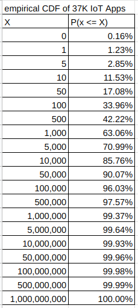

* All (2 million+) Google Play Apps

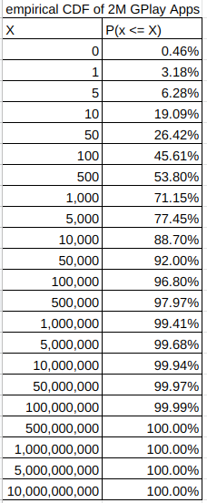

* 2.2K Validation IoT Apps

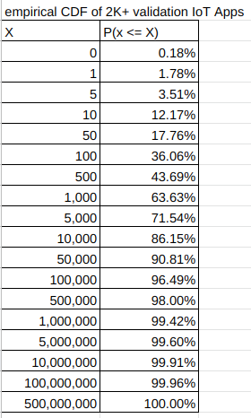

* True Positives of 2.2K Validation IoT Apps

<!--  -->

* False Positives of 2.2K Validation IoT Apps

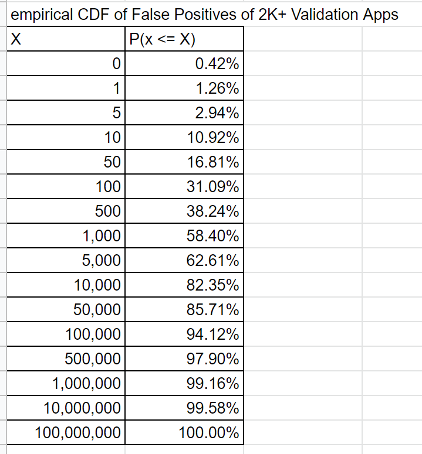

<!--  -->

* 7.2K Labeled Training Apps

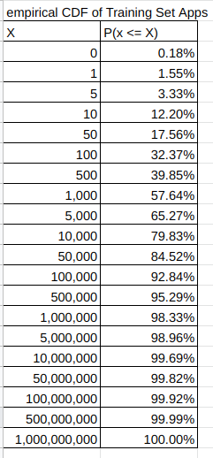

* 917 IoT Apps with 1M+ Downloads

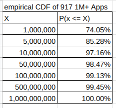

### CDF

* The CDF Curves for Different App Sets

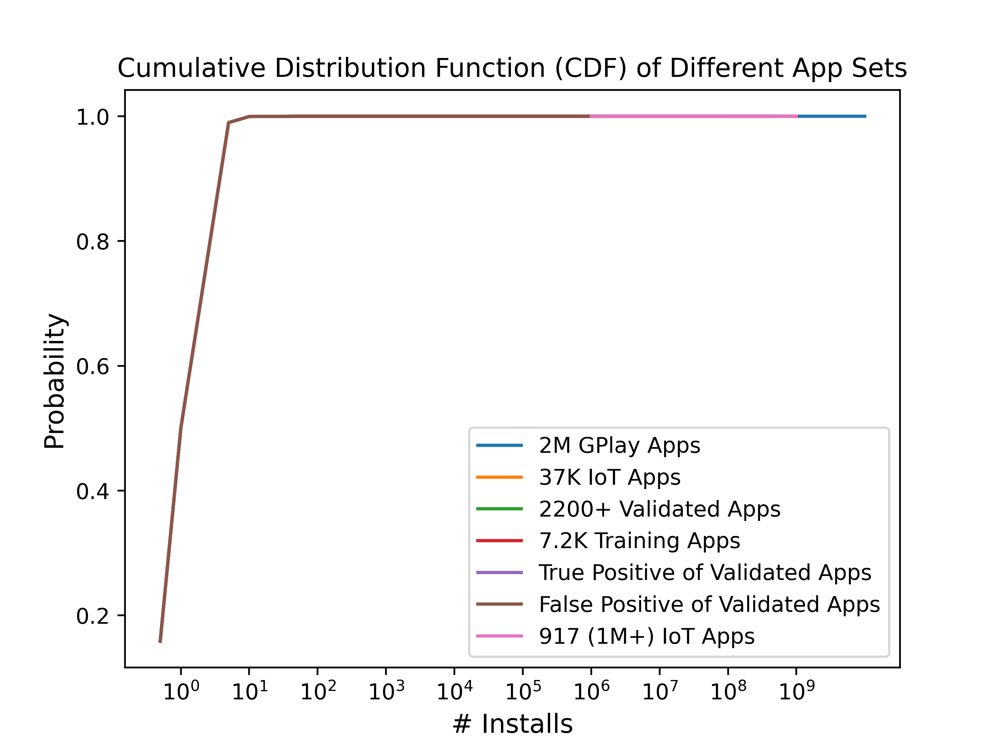

<!--  -->

* 37,783 Identified IoT App

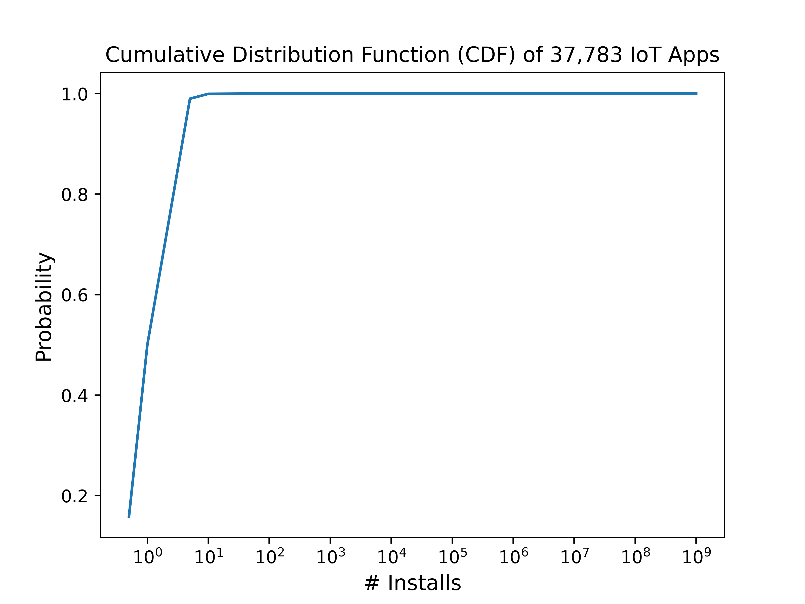

<!-- { width=50%} -->

* All (2 million+) Google Play Apps

<!--  -->

* 2.2K Validation IoT Apps

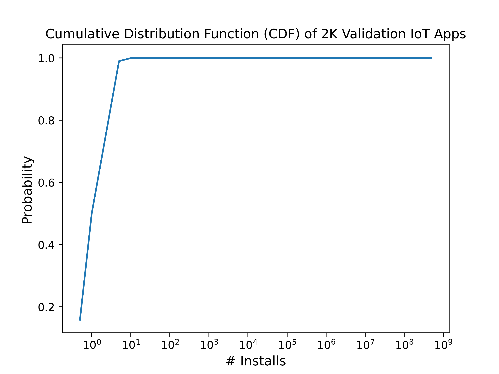

<!--  -->

* True Positives of 2.2K Validation IoT Apps

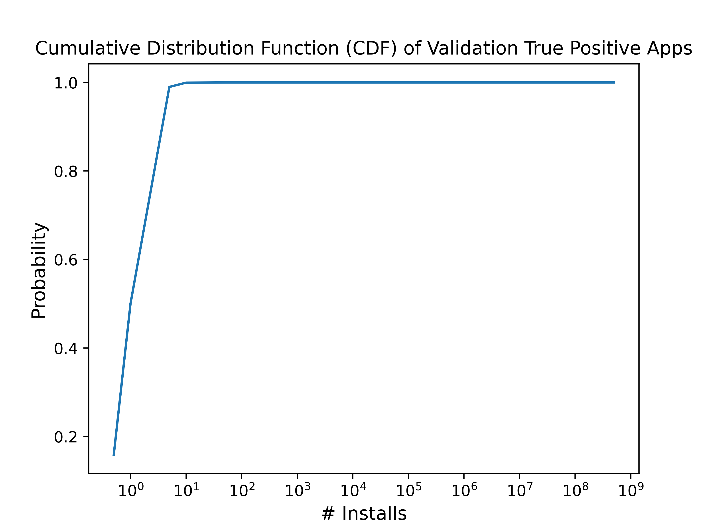

<!--  -->

* False Positives of 2.2K Validation IoT Apps

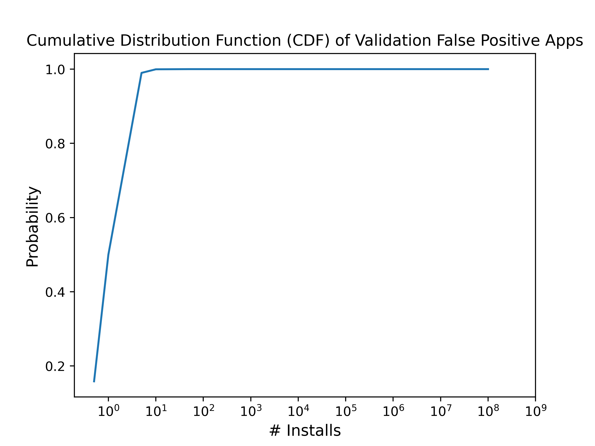

<!--  -->

* 7.2K Labeled Training Apps

<!--  -->
